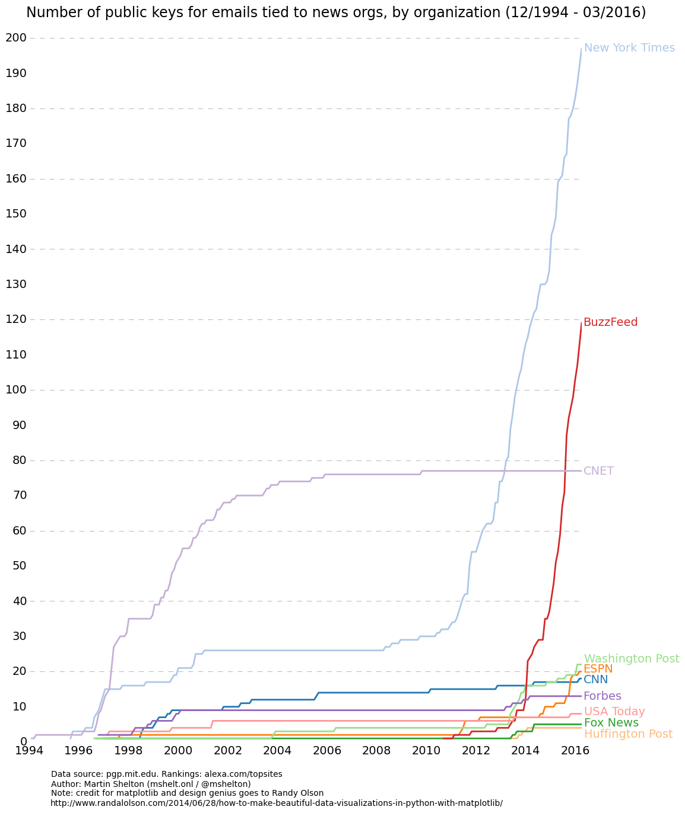

PGP Adoption in News
---------

Using MIT's keyserver data, we can grab, transform, and plotthe number of unique PGP keys and registration
dates for multiple news organizations. I wrote a blog post based on this exercise, and why you may want to
be skeptical about the data: https://medium.com/@mshelton/how-10-news-orgs-adopted-pgp-or-not-cc278531a82b

Dependencies:
* BeautifulSoup4
* pandas
* matplotlib

The Anaconda Python distribution (https://www.continuum.io/downloads) can help install the libraries we need.

Scraping PGP keyserver data
-------------

You can scrape the data using keyserver_soup.py, which  asks the keyserverto look for the news organization's
domain (e.g., "nytimes+com"). We dump the results into a CSV file for cleaning. In my example, this includes
10 news organizations.

      python keyserver_soup.py > dirty_ks_data.csv

Open dirty_ks_data.csv in excel or your spreadsheet editor of choice. Use "text to columns" and select tab
delimiters. This will give you a nicely formatted spreadsheet so you can start removing unwanted entries.
Unfortunately, a good bit of the work now is manual. Parse through your data and remove unwanted users.

Transforming our data
-------------
After spending a bit of time cleaning, you may have a nice list of keys.

We can do a lot of interesting things with our data, including plotting. We can plot the growth of
adoption for each news organization over time. For each case, we need to use a specific format. I found it
helpful to plot by month; you might choose to try it in a different way.

In order to create a line plot of our data, we need a specific format that shows the growth in the numbers
by date. One way to do this is by adding the number of dates when a key was registered for each news org,
and adding them up each day. I wrote a short script (counter.py) that will add up the total number of
registrations each day from count_by_day.csv so that we can map growth for each organization.

      python counter.py > count_by_day.csv

You can open count_by_day.csv in excel and, again, use text by columns to make it easier to work with.

In our final sheet, we number each month so that it can be easily plotted. In this case, our first
month (Dec-94) simply becomes 1. Jan-95 becomes 2, and so on. In the end, you'll have a sheet that looks
like newsdata.csv.

Plotting
-------------

Now that we have the right format, plotting our data should be easy. Run dateplot.py.

      python dateplot.py

If all goes well, it should create a graph in the same folder called pgp_adoption.png.

